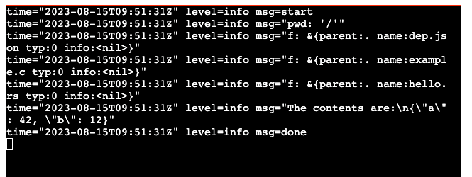

# Test FS in WASM/WASI with Golang



## Prerequisites

- Go version 1.20
- TinyGo 0.28.1

Important: For logrus to be compiled properly we need to use a fork, see https://github.com/sirupsen/logrus/issues/1394#issuecomment-1677997375

## Usage

Build the Wasm binary

```
$ make ci
```

and then build the website

```
$ make web
```

Then go to http://localhost:8080 in your browser
